# This is a PyTorch-CUDA installation tutorial based on Anaconda

## 1 Environment Introduction
pycharm=2022.2.2  
[Anaconda](https://www.anaconda.com/download)=Anaconda3 py310_2023.3-0  
NVIDIA=531.41  
CUDA=12.1  
cuDNN=8.9.0

## 2 PyTorch Environment Preparation
### 2.1 Install Anaconda
[Anaconda3](https://www.anaconda.com/download)  
Nothing much to say here.  
Just keep clicking next [it may take some time].  
[You can change the installation path and whether to let the bundled py310 be recognized as the system Python by IDEA according to your actual situation].  
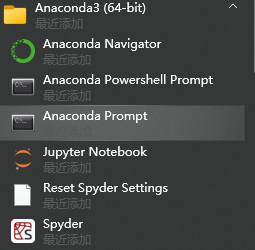  
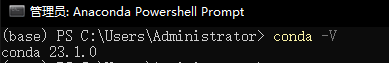

### 2.2 CUDA
First, execute the following in cmd:
```commandline
nvidia-smi
```
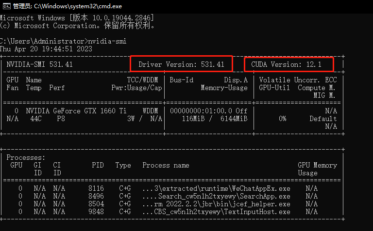
Observe and record your NVIDIA driver version and CUDA version.  
[Check the CUDA version comparison table here](https://docs.nvidia.com/cuda/cuda-toolkit-release-notes/index.html)  
For the author, the NVIDIA driver version is 531.41, so [CUDA=12.1](https://developer.nvidia.com/cuda-downloads) can be installed.  
The author chose the local exe installation; the installation package is quite large, so be patient.  
Also attaching the [CUDA Archive/Previous Versions](https://developer.nvidia.com/cuda-toolkit-archive).  
Once downloaded, open it and keep clicking next.  
If all goes well, two CUDA bin or lib directories will be added to your system environment variable PATH.  
If not, you will need to set them manually.  
Add the bin and libnvvp directories under your CUDA path to the PATH variable.  
If successful, execute the following in cmd:
```commandline
nvcc -V
```
Version information should be output.  
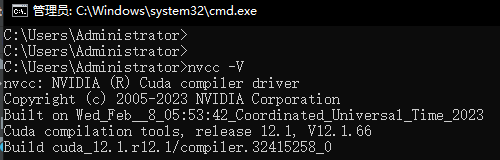

### 2.3 cuDNN
[cuDNN](https://developer.nvidia.com/rdp/cudnn-download)  
Choose the version of cuDNN required based on the CUDA version you installed.  
The author chose 8.9.0 for CUDA 12.x Local Installer for Windows(Zip).  
A VPN/Proxy might be required... Of course, if you can see the original source file of this document (not a repost), it means you have that capability.  
Once downloaded, extract the lib, bin, and include folders from the zip archive into the CUDA installation path (usually C:\Program Files\NVIDIA GPU Computing Toolkit\CUDA\{version}).  
If there are files with the same name, choose replace.  
Then, go to C:\Program Files\NVIDIA GPU Computing Toolkit\CUDA\{version}\extras\demo_suite, open cmd, and execute:
```commandline
bandwidthTest.exe
deviceQuery.exe
```
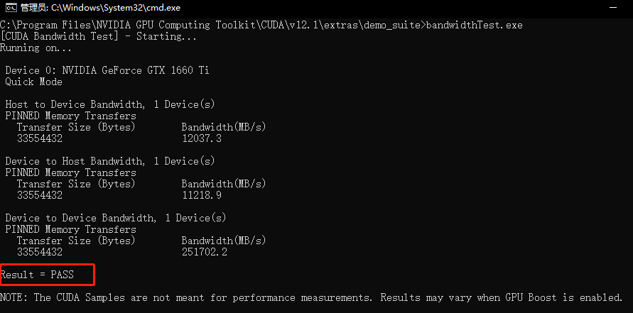
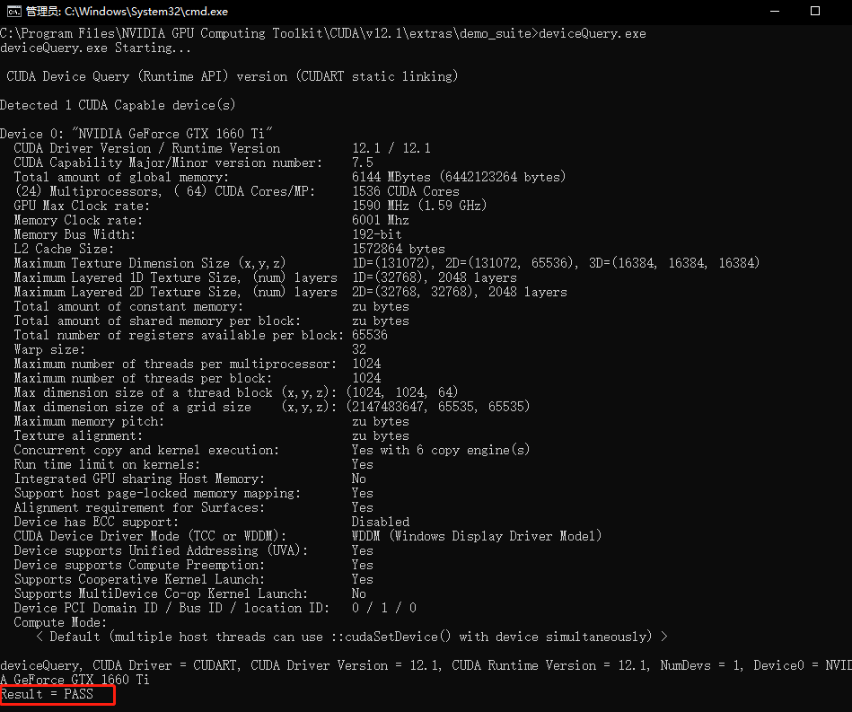
The two commands above should result in `Result=PASS`, indicating success.

## 3 Configure Anaconda Virtual Environment
### 3.1 Configure Default Address for Anaconda Virtual Environments
```commandline
conda config --show
```
Pay attention to the `envs_dirs` field.  
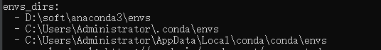
Generally, the first path is the default installation path for virtual environments.  
You can use the following command to change the default path:  
```commandline
conda config --add envs_dirs [absolute path to virtual environments]
```

### 3.2 Create Virtual Environment
```commandline
conda create -n pytorch-test python=3.11
```
`pytorch-test` is the name of the virtual environment.  
`python=` specifies the Python version; you can leave it blank to use the latest version by default.  
Use the following command to view existing virtual environments:
```commandline
conda env list
```
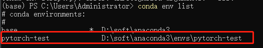

### 3.3 Activate Virtual Environment
(Optional) Please configure your local PyPI mirror sources before this step.  
Use the following command to activate the newly created virtual environment:
```commandline
conda activate pytorch-test
```

### 3.4 Start Installing Torch
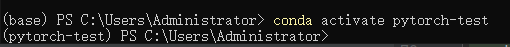
Use the following command to start installing torch (a long wait...):
```commandline
pip3 install torch torchvision torchaudio --index-url https://download.pytorch.org/whl/cu118
```
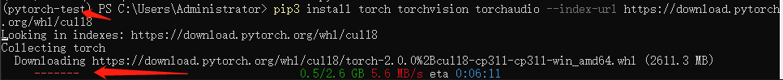
After installation, use the following command to check the pip package list:
```commandline
pip3 list
```
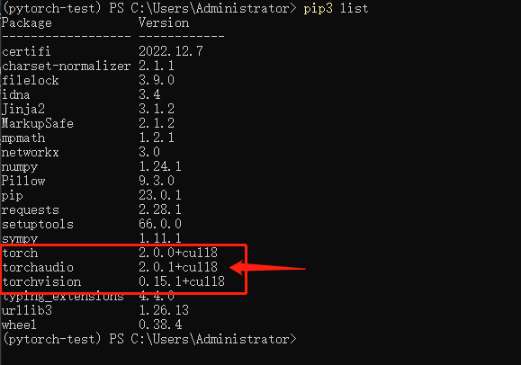
Pay attention to the versions.

## 4 Verify Torch
### 4.1 Use Python IDLE
Enter the Python IDLE:
```commandline
python
```

### 4.2 Import torch package and verify CUDA availability
```python
import torch
torch.cuda.is_available()
```
.png)
If you see `True` displayed here, it means you have successfully installed PyTorch-CUDA!!!

## Donate
### PayPal
Application in progress...
