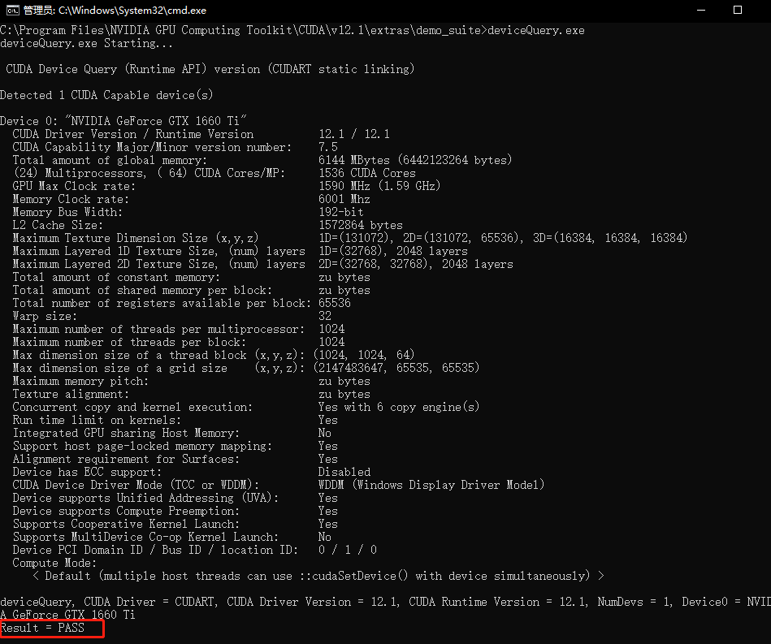

# 这是一篇基于Anaconda的pytorch-cuda安装教程
## 1 环境介绍
pycharm=2022.2.2  
[Anaconda](https://www.anaconda.com/download)=Anaconda3 py310_2023.3-0  
NVIDIA=531.41  
CUDA=12.1  
cuDNN=8.9.0
## 2 pytorch环境准备
### 2.1 安装Anaconda
[Anaconda3](https://www.anaconda.com/download)  
没什么好说的  
一直next即可[可能会花费些许时间]  
[可按照自己的实际情况更改安装路径和是否勾选让Anaconda自带的py310被IDEA识别为系统python]  
  

### 2.2 CUDA
先在cmd执行
```commandline
nvidia-smi
```

观察记录自己的NVIDIA驱动版本和CUDA版本  
[这里查看CUDA版本对照表](https://docs.nvidia.com/cuda/cuda-toolkit-release-notes/index.html)  
作者NVIDIA驱动版本是531.41可安装[CUDA=12.1](https://developer.nvidia.com/cuda-downloads)  
这里作者选择本地exe安装，安装包略大，慢慢等待。  
顺便附上[CUDA历史版本](https://developer.nvidia.com/cuda-toolkit-archive)  
下载完成后打开一路next即可  
不出意外你的系统环境变量PATH会多出两个cuda的bin或lib目录  
如果出了意外，那么需要你手动设置  
在PATH中添加你CUDA路径下的bin和libnvvp  
如果成功了那么cmd执行
```commandline
nvcc -V
```
应该有版本信息输出  

### 2.3 cuDNN
[cuDNN](https://developer.nvidia.com/rdp/cudnn-download)  
根据自己下载安装的CUDA版本来选择需要哪个版本的cuDNN  
作者这里选择8.9.0 for CUDA 12.x Local Installer for Windows(Zip)  
可能需要科学上网。。。当然如果你能看到这篇文档的源文件(非搬运)说明你有这个能力    
好了下载完成后解压压缩包中的lib、bin、include三个文件夹到CUDA安装路径下(一般是C:\Program Files\NVIDIA GPU Computing Toolkit\CUDA\{版本号})  
如果有要重名的选择替换即可
然后进到C:\Program Files\NVIDIA GPU Computing Toolkit\CUDA\{版本号}\extras\demo_suite下打开cmd执行
```commandline
bandwidthTest.exe
deviceQuery.exe
```


上述两个命令会得到两个`Result=PASS`表示成功了
## 3 配置Anaconda虚拟环境
### 3.1 配置Anaconda虚拟环境默认地址
```commandline
conda config --show
```
关注字段envs_dirs

一般第一个路径就是默认虚拟环境的安装路径  
可以使用以下命令更改默认路径  
```commandline
conda config --add envs_dirs 虚拟环境的绝对路径
```
### 3.2 创建虚拟环境
```commandline
conda create -n pytorch-test python=3.11
```
pytorch-test是虚拟环境的名称  
python=指定python的版本，不指定也可以，默认是最新版本。
使用一下命令查看已存在的虚拟环境
```commandline
conda env list
```

### 3.3 激活虚拟环境
(可选的)请在开始本步骤前自行配置国内pypi镜像源(可选的)  
使用以下命令激活到刚刚创建的虚拟环境
```commandline
conda activate pytorch-test
```
### 3.4 开始安装torch

使用以下命令开始安装torch(漫长的等待...)
```commandline
pip3 install torch torchvision torchaudio --index-url https://download.pytorch.org/whl/cu118
```

安装完成后使用以下命令查看pip包列表
```commandline
pip3 list
```

注意版本。
## 4 校验torch
### 4.1 使用 python IDLE
进入python IDLE
```commandline
python
```
### 4.2 导入torch包并验证CUDA可用
```python
import torch
torch.cuda.is_available()
```
.png)
看到这里显示true就表示你已经成功安装了pytorch-CUDA了!!!
## 5 如果您在安装过程中遇到任何问题可以Google但请不要issues因为作者只是个小白
